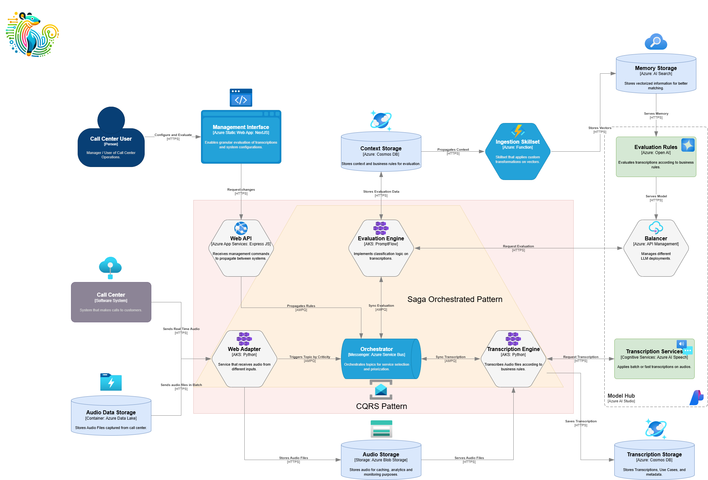

# Tayra - Call Center Analytics GenAI App

Tayra is an advanced call center analytics platform that evaluates and scores call center audio interactions. By converting audio files into transcriptions and applying various evaluation models, Tayra helps organizations measure performance, compliance, and customer satisfaction efficiently. It uses Python-based engines for flexibility and integration with machine learning frameworks, making it adaptable for custom evaluations.

## Business Scenarios for Tayra

Tayra can be tailored to various business scenarios, providing value in key areas:

1. **Customer Experience & Sentiment Analysis**
    - Tayra analyzes customer sentiment during calls by examining tone, word choice, and language. This helps businesses gauge customer satisfaction and identify pain points.
      - *Example 1*: A telecom company can monitor customer complaints and address issues before they escalate.
      - *Example 2*: A retail call center can analyze agent handling of objections and suggest training based on sentiment analysis.

2. **Agent Performance Evaluation**
    - Tayra compares transcriptions against business rules and training guidelines to assess agent performance, including issue resolution, script adherence, and service quality.
      - *Example 1*: In a banking call center, Tayra ensures agents follow regulatory requirements for customer identity verification.
      - *Example 2*: In technical support, it measures call resolution time and satisfaction levels to evaluate troubleshooting efficiency.

3. **Compliance & Regulatory Audits**
    - Tayra evaluates calls for compliance with industry regulations, flagging violations for review.
      - *Example 1*: Financial services can check if agents follow proper disclosure procedures during sales calls.
      - *Example 2*: Healthcare providers can ensure agents handle patient information correctly and comply with privacy laws (e.g., HIPAA).

4. **Custom Use-Cases and Adaptations**
    - Tayra's flexible architecture allows businesses to customize the system for specific needs.
      - *Example 1*: A travel agency can assess how well agents upsell vacation packages.
      - *Example 2*: Insurance companies can identify fraudulent claims by evaluating customer language during claims discussions.

5. **Multi-Language Support and Cross-Cultural Analysis**
    - Tayra supports multiple languages, enabling global organizations to monitor call centers across regions. It helps businesses understand cultural differences in customer interactions and adjust communication strategies.

## Architecture

## Features

Tayra offers the following features:

1. **Audio Response Units**: Capture live calls and store audio files in Azure Data Lake for processing.
2. **Web Adapter**: A Python-based API that retrieves audio files and forwards them to the Transcription Engine.
3. **Transcription Engine**: Uses Azure Cognitive Services to transcribe audio files into text, stored in Azure Cosmos DB.

### Evaluation Engine

4. **Controller Engine (Python)**: Runs Python scripts to evaluate transcriptions based on business rules, using logic-based scoring or machine learning models.
5. **AI-driven Evaluation Engine** (Azure OpenAI & PromptFlow): Uses large language models to analyze sentiment, detect compliance violations, and identify improvement areas.

### Context and Memory Storage

6. **Context Storage (Azure Cosmos DB)**: Stores configuration settings, business rules, and contextual data for evaluations.
7. **Memory Storage (Azure AI Search)**: Stores vectorized represenations of transcriptions for fast retrieval and matching.
8. **Management Interface**: An Azure Static Web App using NestJS and React, allowing users to configure rules, monitor processes, and review results.
9. **Balance and Load Management**: Uses Azure API Management and load balancers to handle large workloads and manage resources during high-traffic periods.

## Getting Started

### Prerequisites

- Windows, Linux, or MacOS
- Python 3.12
- Typescript 14

### Installation

Install frontend and services easily:

- `npm install [package name]`
- `poetry install`

### Quickstart

1. `git clone [repository clone url]`
2. `cd [repository name]`
3. ...

## Demo

A demo app is included to show how to use the project.

To run the demo, follow these steps:

1.
2.
3.

## Resources

- Link to supporting information
- Link to similar sample
- ...
