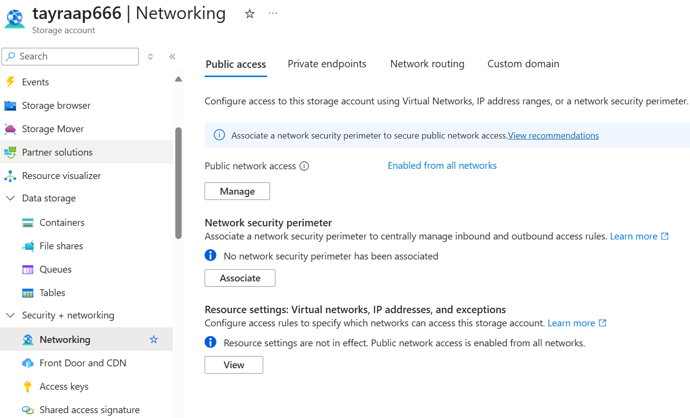

# Tayra - Call Center Analytics GenAI App


Tayra is an advanced call center analytics platform that evaluates and scores call center audio interactions. By converting audio files into transcriptions and applying various evaluation models, Tayra helps organizations measure performance, compliance, and customer satisfaction efficiently. It uses Python-based engines for flexibility and integration with machine learning frameworks, making it adaptable for custom evaluations.

## Business Scenarios for Tayra

Tayra can be tailored to various business scenarios, providing value in key areas:

1. **Customer Experience & Sentiment Analysis**
    - Tayra analyzes customer sentiment during calls by examining tone, word choice, and language. This helps businesses gauge customer satisfaction and identify pain points.
      - *Example 1*: A telecom company can monitor customer complaints and address issues before they escalate.
      - *Example 2*: A retail call center can analyze agent handling of objections and suggest training based on sentiment analysis.

2. **Agent Performance Evaluation**
    - Tayra compares transcriptions against business rules and training guidelines to assess agent performance, including issue resolution, script adherence, and service quality.
      - *Example 1*: In a banking call center, Tayra ensures agents follow regulatory requirements for customer identity verification.
      - *Example 2*: In technical support, it measures call resolution time and satisfaction levels to evaluate troubleshooting efficiency.

3. **Compliance & Regulatory Audits**
    - Tayra evaluates calls for compliance with industry regulations, flagging violations for review.
      - *Example 1*: Financial services can check if agents follow proper disclosure procedures during sales calls.
      - *Example 2*: Healthcare providers can ensure agents handle patient information correctly and comply with privacy laws (e.g., HIPAA).

4. **Custom Use-Cases and Adaptations**
    - Tayra's flexible architecture allows businesses to customize the system for specific needs.
      - *Example 1*: A travel agency can assess how well agents upsell vacation packages.
      - *Example 2*: Insurance companies can identify fraudulent claims by evaluating customer language during claims discussions.

5. **Multi-Language Support and Cross-Cultural Analysis**
    - Tayra supports multiple languages, enabling global organizations to monitor call centers across regions. It helps businesses understand cultural differences in customer interactions and adjust communication strategies.

## Architecture


## Features

Tayra offers the following features:

1. **Call Center Software Integration**: Capture live calls and store audio files in Azure Data Lake for processing.
2. **Web Adapter**: A Python-based API that retrieves audio files and forwards them to the Transcription Engine.
3. **Transcription Engine**: Uses Azure Cognitive Services to transcribe audio files into text, stored in Azure Cosmos DB.

### Evaluation Engine

4. **Orchestrator**: Runs Python scripts to evaluate transcriptions based on business rules, using logic-based scoring or machine learning models.
5. **AI-driven Evaluation Engine** (Azure OpenAI & PromptFlow): Uses large language models to analyze sentiment, detect compliance violations, and identify improvement areas.

### Context and Memory Storage

6. **Context Storage (Azure Cosmos DB)**: Stores configuration settings, business rules, and contextual data for evaluations.
7. **Memory Storage (Azure AI Search)**: Stores vectorized represenations of transcriptions for fast retrieval and matching.
8. **Management Interface**: An Azure Static Web App using NestJS and React, allowing users to configure rules, monitor processes, and review results.
9. **Balancer and API Management**: Uses Azure API Management and load balancers to handle large workloads and manage resources during high-traffic periods.

## Getting Started

### Prerequisites

- Windows, Linux and MacOS
- Python 3.12
- Typescript 14
- [Az CLI](https://learn.microsoft.com/en-us/cli/azure/install-azure-cli-linux?pivots=apt)
- [Docker 27.3.1 or greater](https://www.docker.com/products/docker-desktop/)
- [Docker compose](https://docs.docker.com/compose/install/)
- Azure Subscription
- Azure AI Services (OpenAI Models)
- Azure Cosmos DB
- Azure Storage Account

### Setup

### Quickstart

1. `git clone https://github.com/Azure-Samples/tayra.git`
2. `cd tayra`
3. `az login`
4. `azd init` (answer the prompts to wire azd to this repo)
5. `azd env new <env-name>` (or `azd env select <env-name>` if it already exists)
6. [Configure cosmosdb permissions to access by keys](#cosmosdb-entraid-permissions)
7. Run bicep template to create the resources `az deployment sub create --location eastus2 --template-file infra/main.bicep`. Another option is to use the bicep add-in for VS Code.
8. `azd up`
9. After the deployment is complete, capture any outputs with `azd env set <KEY> <value>` as needed so the env script can mirror them, then get keys for the Cosmos DB, AI Services and the connection string for Storage Account.
10. `docker compose up`
11. After deploy go to http://localhost:3000	

The run script with run four microservices (Evaluation, Transcription, Web Adapter and Web APIs) as well as the frontend application.


#### Environment variables
Copy the provided template and fill in your resource secrets before running any services:

```bash
cp .env.example .env
```

```bash
cd .../tayra
chmod +x infra/scripts/set-env.sh   # one-time setup
azd env select <your-azd-env>       # or `azd env new <name>` if none exists
azd provision                       # populates the env with resource outputs
./infra/scripts/set-env.sh
```

The script mirrors whatever `azd env get-values` returns, so ensure those keys exist. If you need to override anything manually run `azd env set <KEY> <value>` and then rerun the script. Double-check the generated `.env` and update any remaining placeholders before starting services.

#### Cosmos DB
Create a Cosmos DB account and a database.

Create 5 containers for the database:
- managers
- rules
- evaluations
- transcriptions
- humanEvaluations

Configure Network to allow access from the internet.


Get Connection String


#### CosmosDB EntraID permissions

We use the [CosmosDB native RBAC](https://aka.ms/cosmos-native-rbac) to authenticate with the application. Follow the instructions below to give the permission to the user/service-principal:

1. `az login`
2. Allow Key authentication on Azure CosmosDB

```bash
resourceGroupName=<your-resource-group-name>
accountName=<your-cosmosdb-account-name>

az resource update --resource-type "Microsoft.DocumentDB/databaseAccounts" --resource-group $resourceGroupName --name $accountName --set properties.disableLocalAuth=false
```

3. Verify existing role definitions and assignments

```bash
rg=<resource-group>
account=<cosmos-account-name>

# List existing role definitions
az cosmosdb sql role definition list \
  --resource-group "$rg" \
  --account-name "$account" \
  --output table

# Check current role assignments
az cosmosdb sql role assignment list \
  --resource-group "$rg" \
  --account-name "$account" \
  --output table
```

4. Create or assign appropriate roles as needed

```bash
# Create a custom role definition if needed
az cosmosdb sql role definition create \
  --resource-group "$rg" \
  --account-name "$account" \
  --body @role-definition.json

# Assign role to user or service principal
az cosmosdb sql role assignment create \
  --resource-group "$rg" \
  --account-name "$account" \
  --scope "/" \
  --principal-id "<user-or-service-principal-object-id>" \
  --role-definition-id "<role-definition-id>"
```

#### Azure Storage Account
Create a Storage Account and a Blob Container.

Allow access from the internet and keys.

Get Connection String


#### Azure OpenAI - AI Services
[Refernce](https://learn.microsoft.com/en-us/azure/ai-services/speech-service/get-started-speech-to-text?tabs=windows%2Cterminal&pivots=ai-studio)

Create an Azure OpenAI resource and Deploy a GPT-4 model.

Get Endpoint for AI Services and API Key


## Demo

A demo app with sample data is included to show how to use the project. 
The sample data was generated using AI :stuck_out_tongue_winking_eye:. It simulates a conversation between a customer and a contact center company.

To run the demo, follow these steps:

1. Configure the Managers (Configuration -> Configure Managers)
  - Provide a Manager Name
  - Provide a Manager Role (ex: Manager)
  - Add the Team Members/Specialists (Provide the Specialist Name and Role) 
2. Configure the Rules (the criteria to be evaluated)
  - Examples of criteria/description:
    - Cordiality: Demonstrated cordiality with the customer
    - Objectivity: Demonstrated objectivity and transparency with the client
    - Introduction: Introduced yourself to the customer
  - Examples of Business rules
    - clarity, well-communication, customer-obsession
3. Upload the Audio File (Job Management -> Upload). You can use the [sample data](sample/audios/Tayra-Sample-01.mp3) provided.
4. Transcribe the Audio File (Job Management -> Transcribe)
5. Evaluate the Audio File (Job Management -> Evaluate)
6. Analyze the results (Transcription Analysis)

You should see a screen like that with the evaluation results:


## CosmosDB EntraID permissions
We use the [CosmosDB native RBAC](https://aka.ms/cosmos-native-rbac) to authenticate with the application. Follow the instructions below to give the permission to the user/service-principal:

1. `az login`
2. Allow Key authentication on Azure CosmosDB

```bash
resourceGroupName=<your-resource-group-name>
accountName=<your-cosmosdb-account-name>

az resource update --resource-type "Microsoft.DocumentDB/databaseAccounts" --resource-group $resourceGroupName --name $accountName --set properties.disableLocalAuth=false
```

## Resources

- [Azure OpenAI Service](https://azure.microsoft.com/en-us/services/openai-service/)
- [Azure Speech Services](https://learn.microsoft.com/en-us/azure/ai-services/speech-service/overview)
- [Azure Cosmos DB](https://azure.microsoft.com/en-us/services/cosmos-db/)
- [Azure Storage Account](https://learn.microsoft.com/en-us/azure/storage/common/storage-account-overview)

## TO-DO
- Add PowerBI dashboard template with analytics
- Add language selection option
- Add transcription service options (currently only Fast Transcription API is used)
- Add tracking status in the UI for all the features
